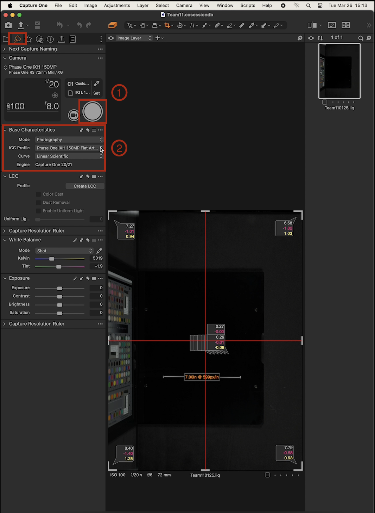
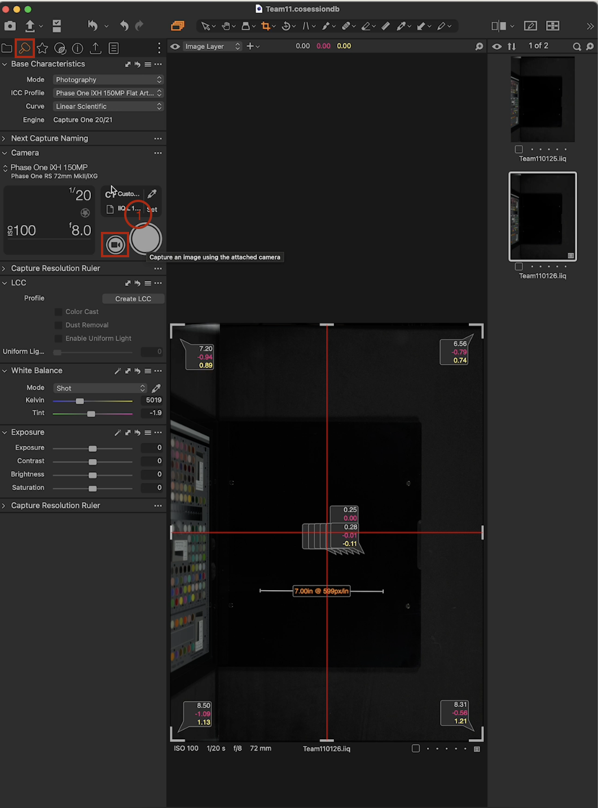

# General Workflow for Digitizing an Object

## Overview

This comprehensive guide outlines the standardized procedures for digitizing physical objects, such as books, documents, maps, and other materials. The digitization process involves capturing high-quality digital images of these objects, enabling their preservation and accessibility in digital formats.

The workflow is divided into several key stages, each addressing specific aspects of the digitization process. These stages are designed to ensure consistent and accurate results, while adhering to industry best practices and the organization's quality standards.

1. **Morning Routine and Software Setup**: This stage covers the essential preparatory steps for the Digitization Team members, including workspace setup, equipment checks, and configuring the capture software with the necessary presets and settings.

2. **Pre-Flight Workflow**: Before initiating the capture process, this stage ensures that the camera settings are properly configured, including resolution, focus, lens cast correction, white balance, and exposure. These adjustments are crucial for accurate reproduction of the original objects.

3. **Digitizing Process**: In this stage, the team members follow a systematic approach to capturing images of the physical objects. This includes cradle preparation, object positioning, image capture techniques, and post-processing adjustments to ensure the highest quality output.

4. **Export Process**: Once the images are captured and processed, this stage focuses on exporting and renaming the digitized files. Consistent naming conventions, high-quality export formats, and organized storage strategies are implemented to facilitate easy retrieval and archiving of the digitized materials.

Throughout the document, special attention is given to providing clear and concise instructions, supported by visual aids such as screenshots, diagrams, and illustrations. Additionally, a glossary of terms is included to ensure a common understanding of the technical vocabulary used in the digitization process.

The guide may in the future address supplementary considerations, such as:

- Receiving, storing, and returning objects for digitization
- End-of-day shutdown and equipment maintenance procedures
- Environmental considerations and safety protocols
- Quality assurance and review processes
- Training and onboarding for new team members
- Version control and documentation updates

By following this comprehensive workflow, the Digitization Team can ensure a streamlined and efficient process, resulting in high-quality digital representations of physical objects that can be preserved and accessible for future use.

It is important to note that this guide is designed as a living document and should be regularly reviewed and updated to reflect any changes in best practices, equipment, or organizational procedures.

Feedback and input from the Digitization Team and other stakeholders are essential for maintaining the relevance and accuracy of this documentation.

---
---

## Morning: Morning Routine and Software Setup

This section outlines the essential steps the Digitization Team members should follow each morning to prepare their workspace and set up the capture software, including its generic presets.

### General Workplace Preparation

1. **Arrival Time:** Arrive at the workplace on time, ready to begin your shift.

    **`Commentary`:** `Confirm the recommended arrival time before the shift start time (is it 10 minutes), if any, with the Digitization Team.`

2. **Check-In Procedures:** Follow the building's security protocols for checking in personal belongings and entering the designated workspaces.

    **`Commentary`:** `Obtain and document the step-by-step process for checking in personal belongings, including the location of the security desk and the process for depositing personal items, liquids, and electronic devices.`

3. **Safety Precautions:**
- Remove any jewelry or functional pieces (e.g. watches) that could get caught in, or damage objects or equipment, for example, the glass section of the cradle[^1.1].
- Wash and dry your hands thoroughly before starting any work. Refrain from using hand sanitizers, oils, creams, moisturizers, or any other products that may contaminate or deteriorate the objects being handled.
- Avoid touching your face or other potential sources of contaminants, as the oils can contaminate the objects and materials.
    - If contamination is unavoidable, wash and dry your hands immediately afterwards.

4. **Hygiene:** `Include specific guidance, if any, on hygiene practices beyond hand washing and avoiding contaminants.`

    **`Commentary`:** `Consult with the trained Digitization Team to determine if any additional hygiene practices or protocols should be included in this section.`

### Hardware Setup

1. **Workspace Covering:**
- Approach the left side of your assigned workstation.
- Unzip the protective covering from the bottom, moving upwards to gain access to the hardware.

    **`Commentary`:** `Confirm the process for assigning workstations to individual team members. If different workstations have different specifications or workflows, document those details.`

2. **Down Lights:**
- Turn on the down lights for the workstation from the power supply labeled "Digital Transitions Heritage".
- Locate the power switch on the extreme left, labeled "POWER."
- When turning on the power supply, confirm the following:
    - Two orange LEDs are lit, indicating it's on.
    - One of the banks ("BANK A" or "BANK B") is switched on, while the other is off. (`Confirm this with the trained Digitizing Team`)
    - The switch with options for 'flash' and 'continuous' is set to 'continuous'.
    - The dial labeled "FLASH" is set to **`+2.3`**.
    - The dial labeled "DIM" is set to **`min`**.
    
    **`Commentary`:** `Confirm the specific settings and configurations for the down lights and power supply with the Digitization Team. If these settings change based on specific scenarios, document those exceptions.`

3. **CPUs:**
- Turn on the two CPUs[^1.2] (`Confirm what to officially call them`) by pressing their power buttons located at the back of the units on the extreme left.
- Confirm that all cables currently connected to the CPUs are secure.

    **`Commentary`:** `Clarify whether the CPUs are shut down or put on standby at the end of the workday.`

4. **Workspace Covering:** Re-zip the protective covering, and access the needed equipment from the front of the workstation when following the next steps.

5. **Cameras:**
- Prepare the cameras by plugging in the relevant loose cables into the ports at the back of the cameras, ensuring the red dots on the cables align with the red dots on the camera ports.
- Unscrew (or remove, based on the type) and remove the lens caps carefully, without harming the lenses underneath.

    **`Commentary`:** `Provide specific instructions on where to securely store the lens caps when not in use.`

6. **CPU Monitors:**
- Ensure the power cable is plugged into the back of the monitor.
- Turn on the monitor by using the switch located at the bottom of the cable.

    **`Commentary`:** `Consult with the trained Digitization Team to determine if any additional devices (e.g., air compressors) need to be set up, and if there are any safety requirements or protocols related to unzipping the workstation covering.`

### Software Setup

1. **Booting Up:** On your assigned CPUs, enter the login credentials.

    **`Commentary`:** `Clarify the process for assigning login credentials and managing passwords. Document any software management protocols, such as updates or version control, that the team must follow.`

2. **Launching Capture One:** Open the **`Capture One`**[^1.3] software program.

3. **Creating a New Session:** From the **`Files`** menu, select **`New Session`**.

4. **Naming Your Session:** Give your session a descriptive name that identifies the project you'll be working on.

    **`Commentary`:** `Confirm with the trained Digitization Team the intended purpose or reasoning behind naming the sessions descriptively.`

5. **System Checks:** Perform a system check to ensure all equipment is functioning properly (`specific instructions on performing this check will be provided in training`).

6. **Software Settings:**

These settings are pre-configured for optimal capture quality, further details can be found in the Pre-Flight section.

- **`Base Characteristics Mode`:** Photography
- **`ICC Profile`:** Phase 1
- **`Camera`:** iXH 150 MP Flat ARt
- **`Reproduction`:** LED `DTPortion` (`Confirm the meaning of this term`)
- **`Curve`:** Linear Scientific

7. **Sharpening and Noise Reduction:**
    **`Commentary`:** `These settings will be adjusted based on the specific document being digitized.`
- **`Sharpening`:**
    - Amount: 90
    - Radius: 0.8
- **`Noise Reduction`:**
    - Details: 50
    - Colour: 40

8. **Retrieving Materials:** Locate the Librarian (or the appropriate personnel) for assistance in retrieving the materials you'll be digitizing.

9. **Material Placement:** Place the materials you'll be working with in the designated cradle.

   **`Commentary`:** `Confirm with the Digitization Team the process for receiving, temporarily storing, and returning objects for digitizing.`

10. **Assistance:** Throughout this process, if you encounter any difficulties or have questions about specific steps, don't hesitate to ask a more experienced team member for assistance.

    **`Commentary`:** `Confirm with the Digitization Team if this is a fair assumption or if there are specific protocols for seeking assistance.`

**`Commentary`:** `Consult with relevant stakeholders to validate the accuracy and completeness of this documentation section. Identify any additional considerations or information that should be included, such as environmental concerns (e.g., the use of food and water in the workspace).`

---
---

## PreFlight: Pre-Flight Workflow (BC 100)

This section refers to the steps taken before starting the capture process.

**`Commentary`:** `Clarify the meaning and context of "BC 100" with the Digitization Team.`

**What's Included:**
The preflight workflow ensures that the camera settings are configured properly, which includes:
- Camera resolution
- Focus
- LCC (Lens Cast Correction)
- White balance
- Exposure

This ensures that images are an accurate reproduction of the original object.

### Base Characteristics

The base characteristics[^2.1] refer to how the system is supposed to be configured at the start of the preflight.

It corresponds to a list of settings in the **`Capture One`** Software under the same name.

1. Click on the **capture button** under the preflight tool tab, located in the Camera settings.
2. **Base Characteristics:** In the section labeled 'Base Characteristics', ensure the following:
    - **Mode:** Ensure the *Mode* is set to **photography**.
    - [**ICC Profile:**](https://www.captureone.com/blog/color-edits-as-icc-profiles) In the same panel, check the *ICC Profile* is set to **Phase One iXH 150MP Flat Art LED DTPortion**.
- **Curve:** In the same panel, also check that *Curve* is set to **Linear Scientific**.

3. **System Check:** Click on the **system check** icon in the left tool tab panel to set the *Sharpening* and *Noise Reduction*.
- **Sharpening:** Ensure *Amount* is set to **90** and Radius is set to **0.8**.
- **Noise Reduction:** In the panel, *Details* is set to **50** and Color is set to **40**.

### Live View

Live View provides a real-time display of what the camera lens is capturing, allowing for adjustments to composition and sharpness. This ensures that the final image meets desired standards before capture.

1. To enter **Live View** mode, click on the **Live View button** under the preflight tool tab.

2. **Set Camera Resolution:** Under the **Camera Focus** panel, set camera two Resolution to 600-PPI.

    **`Commentary`:** `Clarify what "camera two" refers to, whether it is a specific camera on each CPU or a particular camera across all workstations.`

3. **Auto-focus (AF):** In the same panel, select *AF* to allow the software to automatically adjust the camera lens's focus based on the selected focus point. Drag the prompt to target to lock focus, if necessary.
- Use the keys, `Command` + `K`, the window key, or the hand pedal to capture the target.

    **`Commentary`:** `Provide an illustration or explanation of the "window key" and "hand pedal" functionality for users unfamiliar with these terms.`

4. **Zoom:** Using the zoom controls or keyboard shortcuts, zoom into the 600 mark on the target until the 5 resolution lines are visible.

    **`Commentary`:** `Consider including a visual example or screenshot to illustrate the target and resolution lines being referenced.`

5. **Capture:** Press capture to confirm adjustments.

### LCC Board (White Board)

The LCC board[^2.2] is used along with the software to correct lens cast[^2.3], which is produced by uneven lighting across the frame.

The LCC board is placed parallel above the glass plate, matching the angle of the object being photographed.
The LCC board must fill the frame before capturing.

Please use the following steps when using the LCC Board.

1. **Prepare LCC board:** Get the LCC board.
2. **Position Board:** Place the board parallel to the glass, and ensure it covers the frame.
3. **Capture:** Press Capture in the toolbar or use the keyboard shortcut.
4. **Add Colour Readout:** Go to the cursor toolbar and select **`Add Color Readout`**. Ensure the *Color Readout*[^2.4] in the middle of the target reads **`60`** or **`70`**.
5. **Check Readouts:** Make sure readouts in all four corners match the middle.
6. **Adjust Shutter Speed:** If readouts exceed 70, make the necessary adjustments to the shutter speed[^2.5].
7. **Create LCC:** In the LCC panel, select *Create LCC*[^2.6] and capture the target.

### White Balance

This process adjusts the color of the photos captured to accurately represent how they appear in real life under the LCC lighting conditions. Ensuring whites appear truly white rather than a tinted color.

Please use the following steps:

1. **Delete Readouts:** Right-click on the readouts and select delete all.
2. **Zoom:** Using the zoom controls, zoom in on the target[^2.7] to color patch[^2.8] **70** (value changes based on target) and click on it.

    **`Commentary`:** `Provide an explanation or visual aid to clarify what is meant by "target" and "color patch" in this context.`

### Exposure

Exposure adjustments are based on the amount of light that reaches the camera sensor, and is determined by the shutter speed, aperture[^2.9], and ISO[^2.10].

Please use the following steps:

1. **Check Readouts:** Ensure readouts are within the expected range (e.g., close to the color patch value, ideally 70 but 69.0 is acceptable).
2. **Add Readouts:** In the cursor tools section, select the *color editor tool*, and from the dropdown list, select *Add Color Readout* to add readouts to the first 6 patches (Patch 70 - 95).
3. **Adjust Shutter Speed:** Navigate to the Exposure tool and change the shutter speed to match the correct values, typically adjusting to 1/20 or 1/5 (trigger speed).
4. **Coordinate Exposure Settings:** One system does the white balance first, providing the second operator with their setting values. Ensure communication between operators for consistent setting values.

    **`Commentary`:** `Consider including visuals or screenshots to illustrate the exposure adjustment process and the various settings mentioned.`
    
    **`Commentary`:** `Review this section with the Digitization Team to ensure accuracy and completeness. Identify any additional information or clarification needed, such as an explanation of terms like "patches" or specific details on coordinating exposure settings between operators.`

---
---

## Digitizing Process

The digitizing process involves capturing images of documents, books, maps, etc., using specific equipment settings.

**What's Included:**
- Setup and Capture
- Production Settings

### Setup and Capture

This segment guides you through configuring the equipment for accurate image capture and systematically digitizing documents, books, etc.

1. **Cradle Preparation:**
- Get started by using the right foot pedal to raise the cradle glass[^3.1].
- Next, **gently** pull the joystick back to lower the cradle glass into place until it slots into the base.
- Once the cradle is lowered, place your object in the cradle, ensuring proper positioning.
- Add two small targets[^3.2] next to the object to help with alignment and calibration while capturing the image.
- Use the left foot pedal and cradle handle to stabilize the cradle glass.
- Raise the cradle with the joystick by pushing it forward until it meets the glass **gently**.

    **`Commentary`:** `Provide an explanation or visual aid to clarify what is meant by "cradle glass" and "small targets" in this context.`

2. **Image Capture:**
- Capture the image, then **gently** lower the cradle to release the pressure.
- Lift the cradle glass, then turn the page, and repeat the process for each image.

    **`Commentary`:** `Provide more detailed instructions on how to capture the image, including any specific software functions, keyboard shortcuts, or tools to be used.`

### Production Settings

This section covers the adjustments needed to prepare the digitized images for later use, making it easy to have them available for archiving.

1. **Enter Production Tab:** Navigate to the production tab to make adjustments and prepare the images for the next steps.
2. **Image Selection:** In the browser view, left-click on the first image for production, then hold down the Shift key and use the mouse to select the last image to choose all the images in the browser view.
3. **Crop and Straighten:**
- Click on the *crop tool* located in the cursor tools.
- Set *Crop Ratio* to *unconstrained* for flexibility.
- Set *Crop Image* to *Auto Crop* to automatically crop images.
- Select *Method* and set it to *bound material* for objects that are bound together.
- Set the *Straighten* option to *Average*.
- Apply a padding of 100 pixels for a clean look.
4. **Focus Check:** Use the focus tool to ensure all four corners of the images are clear and sharp.

    **`Commentary`:** `Consider including screenshots or visual aids to illustrate the software interface, tools, and settings mentioned in this section.`

**Additional Considerations / Summarized Commentary:**
- Obtain and Document any specific guidance or protocols for handling different types of materials (e.g., books, maps, fragile documents) during the digitizing process.
- Document any exceptions or special scenarios that may arise during the capture process and how to handle them.
- Consult with the Digitization Team to ensure the accuracy and completeness of the instructions provided in this section.

---
---

# General Workflow for Digitizing an Object

## Export: Export Process (DT BC100)

This section outlines the steps for exporting and renaming the processed object (e.g., book) images. It ensures name consistency, high-quality export formats, and organized storage of the digitized page images.

**`Commentary`:** `Clarify the meaning and context of "DT BC100" with the Digitization Team.`

### Batch Rename

Batch rename refers to the feature that allows users to rename multiple files at once. This function saves the user significant time, especially when dealing with a large number of files.

The user can choose specific naming conventions and apply them instantly across a set of files. The formats can be text, numeric, or alphanumeric based on the user's preference. The function essentially uses pattern recognition to rename files in a structured and organized manner.

The following are the steps required to perform batch renaming:

1. Click on the 'Highlight Cursor' icon located in the top ribbon pane.
2. Navigate to and 'Right-Click' on the thumbnail photo and select `Batch Rename`. Alternatively, 'Right-Click' on the empty space of the scanned image and select `Batch Rename`.

   **`Commentary`:** `Clarify what is meant by the "empty space of the scanned image" in this context.`

3. Change `Job Name` to an appropriate name based on the current project.

   **`Commentary`:** `Confirm the naming convention for projects with the Digitization Team. If they do not have a defined convention, recommend implementing one.`

4. **Format**: Ensure the 'Job Name_Current Date_(MMM dd yyyy)' format is adhered to and change the Digit Counter to '4'. This is mostly a default value.

   **`Commentary`:** `Explain the 'Job Name_Current Date_(MMM dd yyyy)' format in more detail.`

5. Click on `...` located in the top right of the window and select `Set Rename Counter`.
6. Set the value to **2** since scanned images will increase in this manner.
   > **NOTE:** The user on the left workstation will change in an even number order (2, 4, 6).
7. Click on `...` in the top right and select `Set Rename Counter Increment`: This should be set to **2** as the increments increase in this manner.
8. Navigate to the bottom right corner of the window and click on **'Rename'**.
- If prompted that the specified RAWs and JPEGs should be paired, click on **`Proceed`**, and the pairing process will not occur.

### Export Recipes

Export Recipes is a feature that enables users to save specific sets of export settings. This tool can be particularly useful for individuals who frequently reuse the same settings, such as color, contrast, resolution, and file type. Saved export recipes allow for quicker and more efficient image processing, eliminating the need to manually adjust settings each time a scan is performed.

Users can create multiple different export recipes depending on the scenarios and reuse them as required.

Below highlights how a user may go about this:

- Navigate to the export tool icon located at the top of the tool pane on the left.
- Under the '**`Export Location`**' pane on the left, rename the '**`Subfolder`**' according to the current project (e.g., Team11_Image Date MM DD YYYY).
- Select the `Export Recipes` tile located on the upper left of the window pane and select `TIFF-Adobe RGB-16 bit` as this is the default setting for most small format projects. It should be highlighted in **orange**.
- Confirm in `Pictures` that the files have been successfully exported.

### Export Format & Size

The Export format and size functionality in Image Scanning software refers to the customization of the final output file format and size.

Users can choose between various options, depending on the final use of the image. For example, **JPEGs** might be selected for their smaller file size, whereas **TIFF** and **PNG** formats may be more suitable for high-resolution needs.

The size of the exported image can be altered according to user preference, factoring in considerations such as storage capacity and the requirements of the platform where the image will be used.

See below:

- Change the bit depth to **16 bit** as this is the default setting.
- Set the resolution: This can be either **400 PPI** for larger format materials or **600 PPI** (Books and Maps). This also is dependent on the photo pixel density.

**`Commentary`:** `Clarify with the Digitization Team the recommended file type(s) and resolution(s) for different types of materials (e.g., books, maps, larger format materials). Additionally, define what constitutes "larger format material" in this context.`

### Export Location

The Export Location feature allows users to select the destination where the processed files will be saved post-scanning. The location can be a specific folder on the local system or even a cloud-based storage service. This precise control over file organization helps in efficient storage and easier access to the scanned images.

Users can save different types of scans to different locations based on their workflow or departmental needs.

- Subfolder naming: Use the following pattern 'jobname-name of item'.
- Click **`Export`**.

Find the exported image by following these steps:

1. Navigate to 'FINDER' which is usually one of the tiles using the shortcut keys, `Command` + `tab`. While holding the `Command` key, continue to tap the `tab` key to cycle through different options.
- Alternatively, use the shortcut keys, `Command` + `Spacebar` to access 'Spotlight' and then type 'Finder' followed by enter into the input box which has appeared on the screen.
2. Navigate to 'Pictures' and find your project name and select 'Output'.
3. Drag and drop the image file(s) to the 'FINAL_Export File'.
4. Move the 'FINAL_Export' file to its respective Storage.

**`Commentary`:** `Consult with the Digitization Team to document any specific file organization and storage best practices, including folder structure and naming conventions.`

**Additional Considerations / Summarized Commentary:**
- Review this section with the Digitization Team to ensure the accuracy and completeness of the instructions provided.
- Identify any additional information or clarification needed, such as exceptions or special cases in the export process.
- Consult relevant stakeholders to validate the validity of this documentation section and identify any other considerations that should be added.

---
---

# Glossary of Terms

[^1.1]: **Cradle:** Placeholder

[^1.2]: **CPU:** Placeholder

[^1.3]: **Capture One:**

[^2.1]: **Base Characteristics:**

[^2.2]: **LCC Board:**

[^2.3]: **Lens Cast:**

[^2.4]: **Color Readout:**

[^2.5]: **Shutter Speed:**

[^2.6]: **LCC:** 

[^2.7]: **Target**

[^2.8]: **Color Patch**

[^2.9]: **Aperture:**

[^2.10]: **ISO**

[^3.1]: **Cradle Glass:**

[^3.2]: **(Small) Target:**

---
---

# Additional Sections to be Considered

Based on the current above documentation (`and personal commentary`), there are a few additional sections or considerations that may be included:

1. **Receiving, Storing, and Returning Objects for Digitization**:
- Document the process for receiving objects from the library or other sources, including any check-in procedures, handling guidelines, and temporary storage protocols.
- Outline the steps for safely returning digitized objects to their original locations or owners, including any necessary documentation or tracking procedures.

2. **End-of-Day Shutdown and Equipment Maintenance**:
- Provide instructions for properly shutting down and securing the workstations, cameras, and other equipment at the end of the workday.
- Include any necessary maintenance tasks, such as lens cleaning, equipment calibration, or backup procedures.

3. **Environmental Considerations**:
- Address any protocols or guidelines related to maintaining a suitable environment for digitization, such as temperature, humidity, or lighting controls.
- Clarify any restrictions or protocols regarding the consumption of food or beverages in the workspace to prevent contamination or damage to the materials being digitized.

4. **Safety and Emergency Procedures**:
- Document any safety protocols or emergency procedures specific to the digitization workspace or equipment.
- Include information on reporting accidents, injuries, or equipment malfunctions.

5. **Training and Onboarding**:
- Outline the training process for new team members, including any required certifications or assessments. (`There was some form of training and testing`.)
- Provide information on accessing additional training resources or seeking assistance from experienced team members.

6. **Quality Assurance and Review**:
- Describe any quality assurance processes or checks in place to ensure the accuracy and consistency of the digitized materials.
- Outline the procedures for reviewing and approving digitized materials before archiving or distribution.

7. **Appendices**:
- Consider including appendices or supplementary materials, such as equipment manuals, software guides, or reference materials relevant to the digitization process.

8. **Version Control and Updates**:
- Implement a version control system for the documentation to track changes and ensure that team members are referencing the most up-to-date information.
- Include a revision history or changelog to document updates and revisions to the documentation.

Due to time constraints, these may be considered, and if viable, included, at a later date.