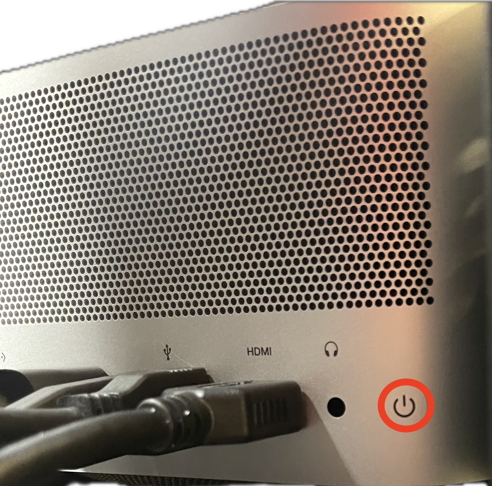
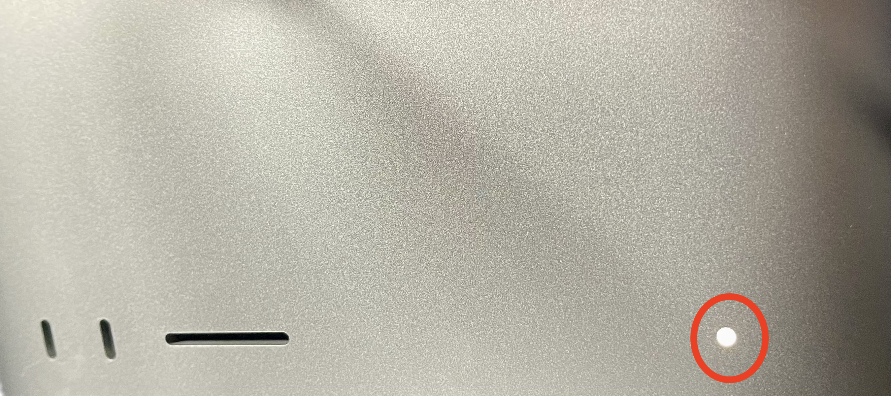
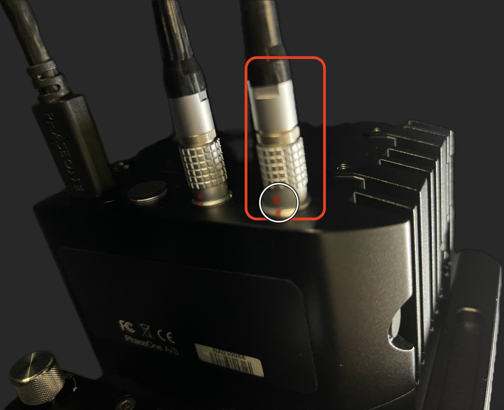
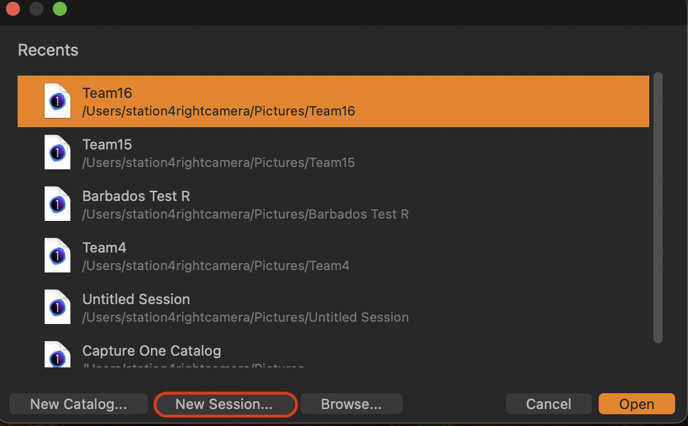
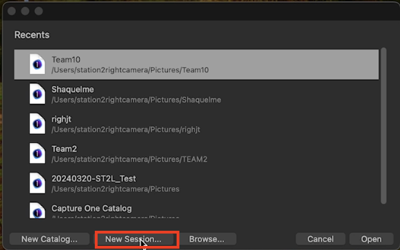
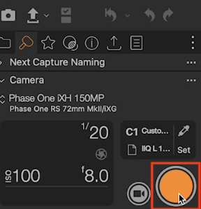
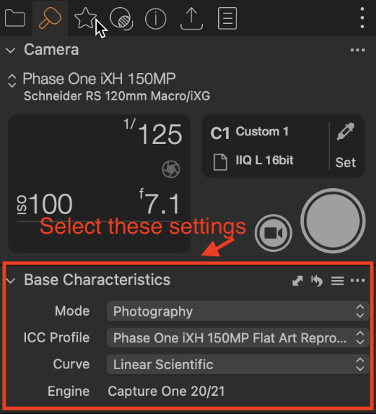
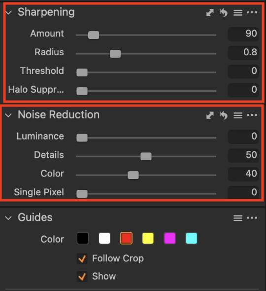

=== "dt BC 100 Scanner"

    This section outlines the essential steps the Digitization Team members should follow each morning to prepare their workspace and set up the capture software, including its generic presets.

    ## 1. General Workplace Preparation

    1. **Arrival Time:** Arrive at the work on time, ready to begin your shift. The current best practice is considered to be ten (10) minutes ahead of the time designated for your shift.

    2. **Check-In Procedures:** Follow the building's security protocols for checking in personal belongings and entering the designated workspaces. This involves checking in with security when entering the building and follow the established protocols for signing into work, which incudes storing relevant items in the specified locations, such as the bag depot.

    3. **Safety Precautions:**
    - Remove any jewelry or functional pieces (e.g. watches) that could get caught in, or damage objects or equipment such as the glass section of the cradle. Confirm with your designated authority the best practices for storing these pieces.
    - Wash and dry your hands thoroughly before starting any work. Refrain from using hand sanitizers, oils, creams, moisturizers, or any other products that may contaminate or deteriorate the objects being handled.
    - Avoid touching your face or other potential sources of contaminants, as the oils can contaminate the objects and materials.
        - If contamination is unavoidable, wash and dry your hands immediately afterwards.

    4. **Hygiene:**
        - Do not carry any liquids or food items into the workspace. All such items should be left at their specified location which your designated authority will specify.
        - When eating, please do so in the specified location, currently the canteen.

    ## 2. Hardware Setup

    1. **Workspace Covering:**
    - Approach the left side of your assigned workstation.
    - Unzip the protective covering from the bottom, moving upwards to gain access to the hardware.

    <figure markdown>
    { width="500px" data-title="Workstation with zipped protective covering" data-description=".custom-desc1" data-gallery="BC 100"}
    <figcaption>Workstation with zipped protective covering</figcaption>
    </figure>
    

      

    

     **Down Lights:**
    - Turn on the down lights for the workstation from the power supply labeled "Digital Transitions Heritage".
    - Locate the power switch on the extreme left, labeled "POWER."
    - When turning on the power supply, confirm the following:
        - Two orange LEDs are lit, indicating it's on.
        - The switches with options for 'flash' and 'continuous' is set to 'continuous'.
        - The dial labeled "FLASH" is set to **`+2.3`**.
        - The dial labeled "DIM" is set to **`min`**.

    <figure markdown>
    { width="1000px" data-title="Lighting Power Supply" data-description=".custom-desc2" data-gallery="BC 100"}
    <figcaption>Lighting Power Supply</figcaption>
    </figure>
    

      

    

    3. **Computers:**
    - Turn on the two computers by pressing their power buttons located at the back of the units on the extreme left.
    - A **WHITE** LED, ⚪ , should be illuminated once the workstation has been successfully powered on. 
    - Confirm that all cables currently connected to the computers are secure.

    <figure markdown>
    { width="500px" data-title="Workstation Computer's Power Button" data-description=".custom-desc3" data-gallery="BC 100"}
    <figcaption>Workstation Computer's Power Button</figcaption>
    </figure>
    

      

    

    <figure markdown>
    { width="500px" data-title="Workstation Power Indicator " data-description=".custom-desc3-5" data-gallery="BC 100"}
    <figcaption>Workstation Power Indicator</figcaption>
    </figure>
    

      

    

    4. **Workspace Covering:** Re-zip the protective covering, and access the needed equipment from the front of the workstation when following the next steps.

    5. **Cameras:**
    - Prepare the cameras by plugging in the relevant loose cables into the ports at the back of the cameras, ensuring the red dots on the cables align with the red dots on the camera ports.
    - Unscrew and remove the lens caps carefully, without harming the lenses underneath.

    <figure markdown>
    { width="300px" data-title="Unplugged Power Cable" data-description=".custom-desc4" data-gallery="BC 100"}
    <figcaption>Unplugged Power Cable</figcaption>
    </figure>
    

      

    

    <figure markdown>
    { width="300px" data-title="Connected Power Cable" data-description=".custom-desc5" data-gallery="BC 100"}
    <figcaption>Connected Power Cable</figcaption>
    </figure>
    

      

    

     **Computer Monitors:**
    - Ensure the power cable is plugged into the back of the monitor.
    - Turn on the monitor by using the switch located at the bottom of the cable.

    <figure markdown>
    { width="300px" data-title="Monitor Power Cable" data-description=".custom-desc6" data-gallery="BC 100"}
    <figcaption>Monitor Power Cable</figcaption>
    </figure>
    

      

    

    ## 3. Software Setup

    1. **Booting Up:** On your assigned computer, enter the login credentials.

    2. **Launching Capture One:** Open the **`Capture One`** software program.

    3. **Creating a New Session:** From the **`Files`** menu, select **`New Session`**.

    <figure markdown>
    { width="586px" data-title="New Session in Open Capture" data-description=".custom-desc7" data-gallery="BC 100"}
    <figcaption>New Session in Open Capture</figcaption>
    </figure>
    

      

    

    4. **System Checks:** Perform a system check to ensure all equipment is functioning properly.

    5. **Software Settings:**

    The `Base Characteristics` settings are **pre-configured** for optimal capture quality, while further details can be found in the Pre-Flight section of the software, as well as the documentation.

    Under normal circumstances, you will not need to manually insert these values.

    In the extreme left you will find the sections where the values will be edited. The large white circle is the main method capturing images and must be clicked to alter any settings.

    - **`Base Characteristics`:**
        - **`Mode`:** Photography
        - **`ICC Profile`:** Phase One iXH 150 MP Flat Art LED `DTPortion`
        - **`Curve`:** Linear Scientific

    Under System Check section
    - **Sharpening and Noise Reduction:**
        - **`Sharpening`:**
            - Amount: 90
            - Radius: 0.8
        - **`Noise Reduction`:**
            - Details: 50
            - Colour: 40

    6. **Retrieving Materials:** Locate the Porter (or the appropriate personnel) for assistance in retrieving the materials you'll be digitizing.

    7. **Material Placement:** Place the materials you'll be working with in the designated cradle.

    8. **Assistance:** Throughout this process, if you encounter any difficulties or have questions about specific steps, don't hesitate to ask a more experienced team member for assistance.

=== "dt Versa Flatbed Scanner" 

    Digitization Team: Morning Routine Preparation

    !!! note "Note"
        This document outlines the necessary steps followed by the Digitization Team to prepare their software and workspace for using the DT Versa Flatbed Scanner.

         **NOTE**: Any additional changes to this file will be in colored in **blue text**.

    ## General Workspace Preparation
    1. **Check in Bags**: Ensure all personal belongings are stored securely.
    2. **Remove Jewelry**: Remove any jewelry that may come into contact with the scanner or documents.
    3. **Wash & Dry Hands**: Wash and dry your hands thoroughly.
    4. **Put on Gloves**: Wear nitrile or cotton gloves for handling documents.

    ## Camera Lens Attachment
    1. **Verify Lens**: Check if the current lens on the camera is the 120mm macro lens.
    2. **Change Lens** (if necessary):
        * Unclip the silver latches from the front and back of the lens.
        * Gently pull off the incorrect lens.
        * Attach the correct **120mm** macro lens to the camera body.
        * Push the lens until it clicks into place.
        * Close and secure the silver latches.
    3. **Remove Lens Cap**: Remove the lens cap from the 120mm macro lens.

    ## Camera Settings
    1. **Connect Lemo Cord**: Plug the silver lens cord with the **red dot** into the back of the camera.

    ## Light Settings
    1. **Turn on LED Light**:
        * For scanning translucent materials (like film negatives), use the small LED light.
        * Place the light above the bench and underneath the document cradle.
    2. **Turn off Overhead Lights**: Turn off the overhead fluorescent lights to avoid glare and ensure consistent lighting.

    ## Software Settings
    1. **Turn on Computer**: Power on your computer and enter your password.
    2. **Open Capture One Software**: Launch the Capture One software application.
    3. **Create New Session**:

        * Go to the "File" menu and select "New Session."

        <figure markdown>
        { data-title="New Session from Capture One" data-description=".custom-desc1" data-gallery="Flatbed"}
        <figcaption>New Session from Capture One</figcaption>
        </figure>
        

        
New Session

        

        * Give the new session a descriptive name.
    4. **Activate Camera & System**: Click the "Capture" button to activate the camera and the DT Versa system.

        <figure markdown>
        { data-title="Capture Button" data-description=".custom-desc2" data-gallery="Flatbed"}
        <figcaption>Capture Button</figcaption>
        </figure>
        

        

        

    ## System Check
    1. **Verify Base Characteristics**: Ensure the following settings are selected:

        <figure markdown>
        { data-title="Base Characteristics" data-description=".custom-desc3" data-gallery="Flatbed"}
        <figcaption>Capture Button</figcaption>
        </figure>
        

        

        

    
      * Mode: Photography
      * ICC Profile: Phase One iXH 150 Flat Art Reproduction LED DTPortion
      * Curve: Linear Scientific
    
    2. **Sharpening**: Set the sharpening settings to:
        * Sharpening: 90
        * Radius: 0.8
    3. **Noise Reduction**: Set the noise reduction settings to:
        * Details: 50
        * Colour: 40

    <figure markdown>
    { data-title="Sharpening & Noise Reduction" data-description=".custom-desc4" data-gallery="Flatbed"}
    <figcaption>Sharpening & Noise Reduction</figcaption>
    </figure>
    

    

    

    **Next Steps**

    * Clarify with the Porter/Material Retrievers for instructions on retrieving and placing materials onto the scanner bed.

    **Additional Notes**
    
    * This document serves as a general guideline. Specific adjustments might be required depending on the type of material being scanned.
    * Consult with the Digitization Team Lead for any questions or if you encounter any difficulties during the setup process.
