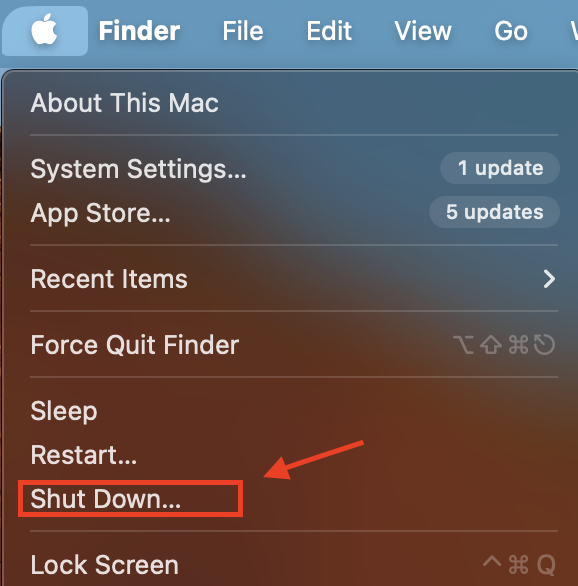
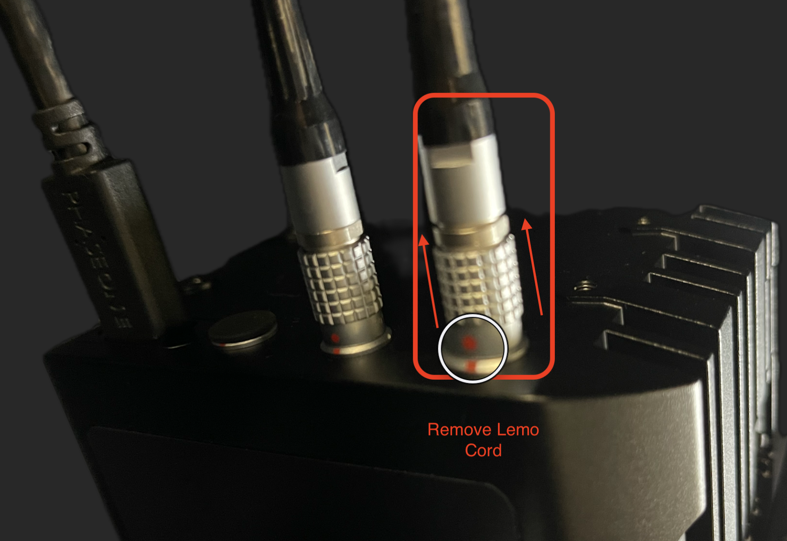

# Guide on Shut Down Process for DT BC100 Scanner and DT Versa Flatbed Scanner

!!! note "Note"
    Executing the correct shut down process is crucial for extending the life of your equipment and mitigating unnecessary wear.
    
    Follow the steps below to correctly shut down your system:

## Steps for Shutting Down

1. **Save and Export All Information:**
    After you finish the scanning task, make sure all the information has been successfully saved to storage. Confirm the successful exportation of all data to avoid any data loss.

2. **Close All Software and Applications:**
    Shut down the Capture One software first. Make sure you close all open tabs and windows before proceeding.

3. **Shut Down the System:**
    - To shut down the system, navigate to the apple sign located in the top left-hand corner of your screen.
    - Click on the apple sign and select "Shut Down" from the dropdown menu.

<figure markdown>
{ width="550px" data-title="Shut Down" data-description=".custom-desc1"}
<figcaption>Shut Down</figcaption>
</figure>

  

!!! note ""
    The computer will commence its shutdown sequence.
    
    All lights on the computer & keyboard should be off when shut down is complete.

4. **Handle the Camera Carefully After Use:**
    Carefully put the lens cap back on the Camera to protect the lens from any physical damage.

<figure markdown>
{ width="550px" data-title="Lens Cap" data-description=".custom-desc2"}
<figcaption>Lens Cap</figcaption>
</figure>

  

6. **Turn off Camera's Power Supply:**
    To switch off the camera, pull out the lemo power cord.

<figure markdown>
{ width="550px" data-title="Remove Lemo Power Cord" data-description=".custom-desc3"}
<figcaption>Remove Lemo Power Cord</figcaption>
</figure>

  

8. **Turn Off LED Lights:**
    To turn off the LED lights, find the switch on the black power bank and flip it to the “off” position.

9. **Store the Workstation:**
    If you had unzipped the workstation coverage during your work, please remember to zip it down again.

> Following all these shut down steps can significantly prevent potential problems and help with the longevity of your equipment.
