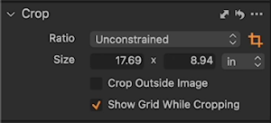
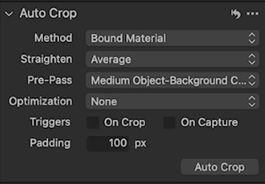

=== "dt BC 100 Scanner"
    The digitizing process involves capturing images of documents, books, maps, etc. using specific equipment settings. 

    ## Setup and Capture
    This segment guides you through configuring the equipment for accurate image capture and systematically digitizing those objects. 

    1. **Cradle Preparation:**
    - Get started by using the right foot pedal to raise the cradle glass.
    - Next, **gently** pull the joystick back to lower the cradle into place until it slots into the base.
    - Once the cradle is lowered, place your object in the cradle, ensuring proper positioning.
    - Add two small targets next to the object to help with alignment and calibration while capturing the image.
    - Use the left foot pedal and cradle handle to stabilize the cradle glass.
    - Raise the cradle with the joy stick by pushing the joystick forward until it meets the glass **gently**.

    !!! note
        The right foot pedal raises the cradle glass, the left foot pedal lowers the cradle glass and the joystick moves the cradle.

    2. **Image Capture:**
    - Capture the image, then **gently** lower the cradle to release the pressure.
    - Lift the cradle glass, then turn the page, and repeat the process for each image.

    ## Production Settings
    This section covers the adjustments needed to prepare the digitized images for later use, making it easy to have them available for archiving.

    1. **Enter Production Tab:** Navigate to the production tab to make adjustments and prepare the images for the next steps.
    2. **Image Selection:** In the browser view, click with the ++left-button++ on the first image for production, then hold down the ++shift++ key and use the mouse to select the last image to choose all the images in the browser view.
    3. **Crop and Straighten:**

    <figure markdown>
    { width="350px" data-title="Crop Tools from Capture One" data-description=".custom-desc1"}
    <figcaption>Crop Tools from Capture One</figcaption>
    </figure>
    

      
Lorem ipsum

      
Lorem ipsum.

    

    - Click on the *crop tool* located in the cursor tools.

    <figure markdown>
    { width="350px" data-title="Crop Ratio from Capture One" data-description=".custom-desc2"}
    <figcaption>Crop Ratio from Capture One</figcaption>
    </figure>
    

      
Lorem ipsum

      
Lorem ipsum.

    

    - Set *Crop Ratio* to *unconstrained* for flexibility. 

    <figure markdown>
    { width="350px" data-title="Autocorrect from Capture One" data-description=".custom-desc3"}
    <figcaption>Autocorrect from Capture One</figcaption>
    </figure>
    

      
Lorem ipsum

      
Lorem ipsum.

    

    - Set *Crop Image* to *Auto Crop* to automatically crop images.
    - Select *Method* and set it to *bound material* for objects that are bound together.
    - Set the *Straighten* option to *Average*.
    - Apply a padding of 100 pixels for a clean look. 
    4. **Focus Check:** Use the focus tool to ensure all four corners of the images are clear and sharp.

=== "dt Versa Flatbed Scanner"
    The digitizing process involves capturing images of documents, books, maps, etc. using specific equipment settings. 

    ## Setup and Capture
    This segment guides you through configuring the equipment for accurate image capture and systematically digitizing those objects. 

    1. **Cradle Preparation:**
    - Get started by using the right foot pedal to raise the cradle glass.
    - Next, **gently** pull the joystick back to lower the cradle into place until it slots into the base.
    - Once the cradle is lowered, place your object in the cradle, ensuring proper positioning.
    - Add two small targets next to the object to help with alignment and calibration while capturing the image.
    - Use the left foot pedal and cradle handle to stabilize the cradle glass.
    - Raise the cradle with the joy stick by pushing the joystick forward until it meets the glass **gently**.

    > [!Note]
    > The right foot pedal raises the cradle glass, the left foot pedal lowers the cradle glass and the joystick moves the cradle.

    2. **Image Capture:**
    - Capture the image, then **gently** lower the cradle to release the pressure.
    - Lift the cradle glass, then turn the page, and repeat the process for each image.

    ## Production Settings
    This section covers the adjustments needed to prepare the digitized images for later use, making it easy to have them available for archiving.

    1. **Enter Production Tab:** Navigate to the production tab to make adjustments and prepare the images for the next steps.
    2. **Image Selection:** In the browser view, left-click on the first image for production, then hold down the Shift key and use the mouse to select the last image to choose all the images in the browser view.
    3. **Crop and Straighten:**
    

    - Click on the *crop tool* located in the cursor tools.

    

    - Set *Crop Ratio* to *unconstrained* for flexibility. 

    

    - Set *Crop Image* to *Auto Crop* to automatically crop images.
    - Select *Method* and set it to *bound material* for objects that are bound together.
    - Set the *Straighten* option to *Average*.
    - Apply a padding of 100 pixels for a clean look. 
    4. **Focus Check:** Use the focus tool to ensure all four corners of the images are clear and sharp.

