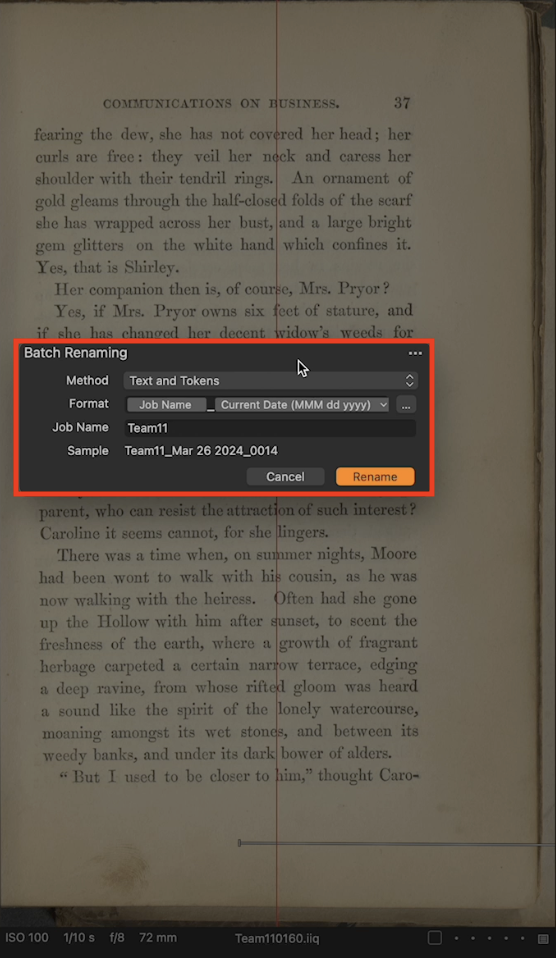
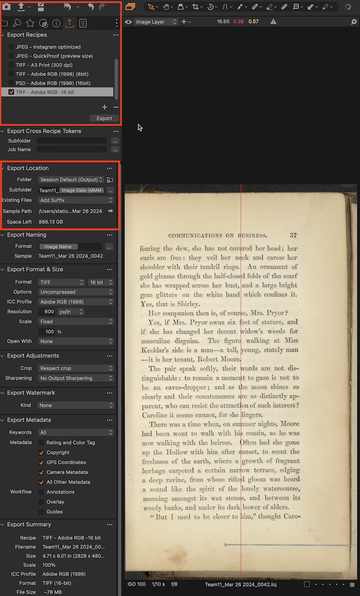
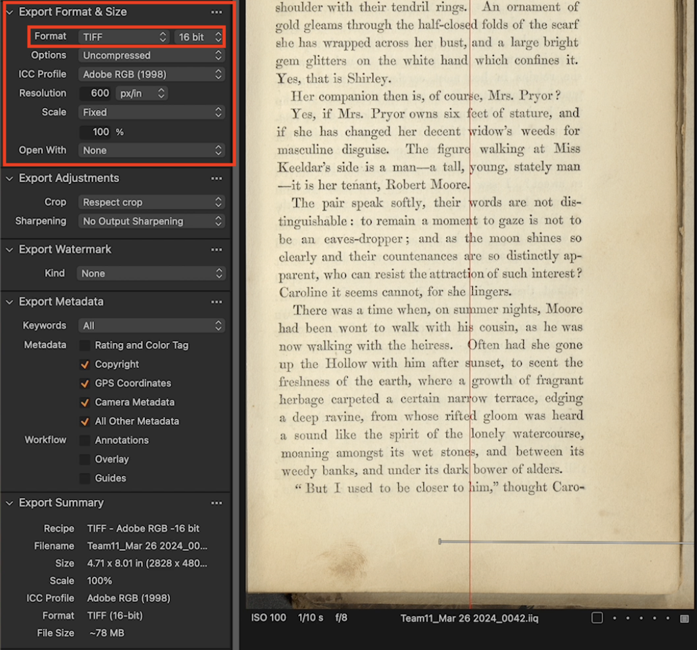
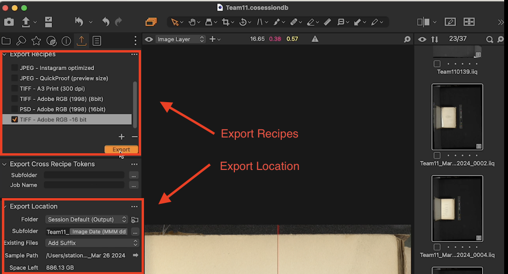
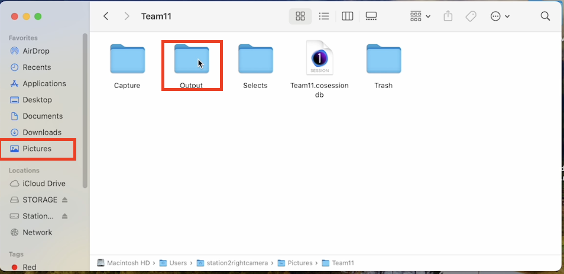
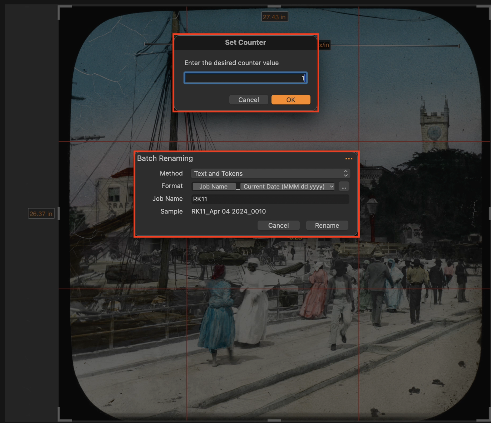
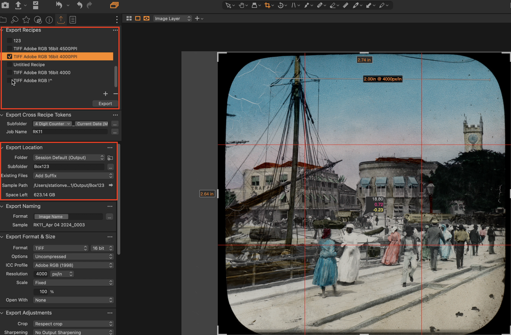
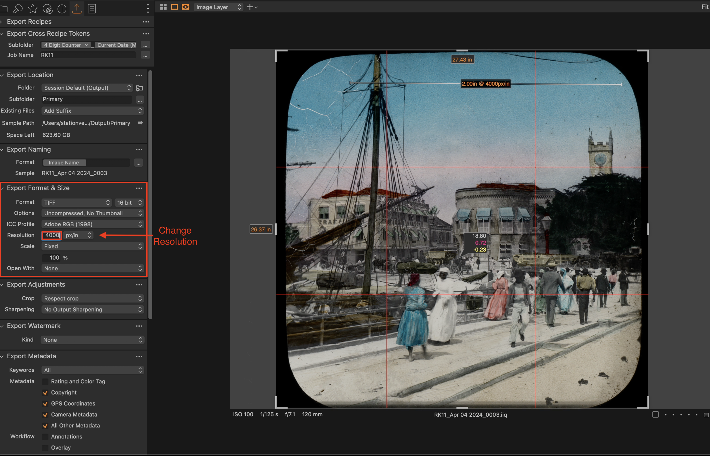
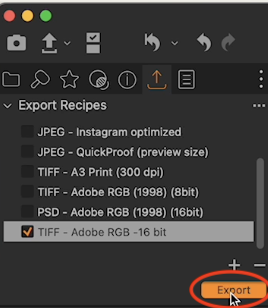

=== "dt BC100 Scanner"

    !!! note
        The following guide provides instructions on how to export images that have been digitized. This guide will now conclude the preceding 3 stages.

    This section will outline the steps for exporting and renaming the processed object Eg.(Book) images. It ensures name consistency, high-quality export format, and organized storage of the digitized book page images.

    **Follow the steps described below to successfully execute the export process.**

    ## 1.1 Batch Rename
    Batch rename refers to the feature that allows users to rename multiple files at once. This function saves the user significant amount of time, especially when dealing with a large number of files. The user can choose specific naming conventions and apply them instantly across a set of files. The formats can be text, numeric or alphanumeric based on the the user's preference. The function essentially uses pattern recognition to rename files in a structured and organized manner.

    <figure markdown>
    { width="350px" data-title="Batch Rename from Capture One" data-description=".custom-desc1"}
    <figcaption>Batch Rename from Capture One</figcaption>
    </figure>
    

      
Batch Rename from Capture One overlaying book, 

      

    

    1. Highlight Cursor Icon located in the Top ribbon pane.

    2. Navigate to and click with the ++right-button++ on the thumbnail photo and select `Batch Rename`

        -(*Alternatively*) click with the ++right-button++ on empty space of scanned image and select `Batch Rename`
    3. Change `Job Name` to an appropriate name based on current project.

    4. **Format**: Ensure '**Job Name_Current Date_(MMM dd yyyy**)' format is adhered to and change the Digit Counter to '4'. This is mostly a default value.

    5. Cick on '...' located to the top right of window and select `Set Rename Counter`
    6. Set value to **2** since scanned images will increase in this manner.
    ???+ note "Note"
        The user of left workstation  will use page 1,  while the user of the right workstation will use page 2.
        
        The user of workstation 1 scans images in an odd number order (1,3,5) while the user of workstation 2 scans the images in an even number order (2,4,6).
    
    7. Click on '...' to the top right and select  `Set Rename Counter Increment`: This should be set to **2** as the increments increase in this manner.
    
    8. Navigate to the bottom right corner of window and click on  **'Rename'**.
    
        -If prompted that the specified RAWs and JPEGs should be paired, click on **'Proceed'** and the pairing process will not occur.

    ## 1.2 Export Recipes

    Export Recipes is a feature that enables users to save specific sets of export settings. This tool can be particularly useful for individuals who frequently reuse the same settings such as color, contrast, resolution and file type. Saved export recipes allow for quicker and more efficient image precesses, eliminating the need to manually adjust settings each time a scan is performed. Users can create multiple different export recipes depending on the scenarios and reuse them as required. Below highlights how a user may go about this:

    <figure markdown>
    { width="400px" data-title="Export Recipes from Capture One" data-description=".custom-desc2"}
    <figcaption>Export Recipes from Capture One</figcaption>
    </figure>
    

      
Export Recipes from Capture One.

      
Lorem ipsum.

    

    - Navigate to the export tool icon located at the top of the tool pane on the left ().

    - Under '**Export Location**' pane on the left, rename the '**Subfolder**' according to the current project Eg.(Team11_Image Date MM DD YYYY)
    - Select `Export Recipes` tile located on the upper left of window pane and select `TIFF-Adobe RGB-16 bit` as this is the default setting for most small format projects. It should be highlighted in **orange**
    - Confirm in `Pictures` that the files have been successfully exported.

    ## 1.3 Export Format & Size

    The Export format and size functionality in Image Scanning software refers to the customization of the final output file format and size. Users can choose between various options, depending on what their final use of the image. For example, **JPEGs** might be selected for their smaller file size, whereas **TIFF** and **PNG** format may be more suitable for high resolution needs.The size of the exported image can be altered according to user preference, factoring in considerations such as storage capacity and the requirements of the platform where the image will be used. See below:

    <figure markdown>
    { width="500px" data-title="Export Format & Size from Capture One" data-description=".custom-desc3"}
    <figcaption>Export Format & Size from Capture One</figcaption>
    </figure>
    

      
Export Format & Size from Capture One.

      
Lorem ipsum.

    

    - Change bit depth to **16 bit** as this is the default setting
    - Set the resolution: This can be either **400 PPI** for larger format material or **600 PPI** (Books and Maps). This also is dependent on the photo pixel density.

    ## 1.4 Export Location

    The Export Location feature allows users to select the destination where the processed files will be saved post-scanning. The location can be a specific folder on the local system or even cloud based storage service. This precise control over file organization helps in efficient storage and easier access of the scanned images, Users can save different types of scans to different locations based on their workflow or departmental needs.

    <figure markdown>
    { width="600px" data-title="Export Location from Capture One" data-description=".custom-desc4"}
    <figcaption>Export Location from Capture One</figcaption>
    </figure>
    

      
Export Location from Capture One.

      
Lorem ipsum.

    

    - **Subfolder naming**: Use the following pattern 'jobname-name of item'.
    - Click **'Export'**.

    Find the exported image by following these steps:

    1. Navigate to 'FINDER' which is the second tile using `Command+tab` shortcut key.
    2. Navigate to 'Pictures' and find your project name and select 'Output'.
    3. Drag and drop the image file/s to the 'FINAL_Export File'.
    4. Move 'FINAL_Export' file  to its respective Storage.

    <figure markdown>
    { width="500px" data-title="Output Location from Capture One" data-description=".custom-desc5"}
    <figcaption>Output Location from Capture One</figcaption>
    </figure>
    

      
Output Location from Capture One.

      
Lorem ipsum.

    

=== "dt Versa Flatbed Scanner"

    !!! note
        The following guide provides instructions on how to export images. This workstation includes essentially the same process with a few highlighted additions below.
        
    This section will outline the steps for exporting and renaming the processed object using the DT Versa It ensures name consistency, high-quality export format, and organized storage of the digitized book page images.

    **Follow the steps described below to successfully execute the export process.**

    ## 4.1 Batch Rename 

    Batch rename refers to the feature that allows users to rename multiple files at once. This function saves the user significant amount of time, especially when dealing with a large number of files. The user can choose specific naming conventions and apply them instantly across a set of files. The formats can be text, numeric or alphanumeric based on the the user's preference. The function essentially uses pattern recognition to rename files in a structured and organized manner.

    <figure markdown>
    { width="600px" data-title="Batch Rename & Set Counter" data-description=".custom-desc1"}
    <figcaption>Batch Rename & Set Counter</figcaption>
    </figure>
    

    
Batch Rename & Set Counter

    
Lorem ipsum.

    

    1. Highlight Cursor Icon located in the Top ribbon pane.

    2. Navigate to and click with the ++right-button++ on the thumbnail photo and select `Batch Rename`

        -(Alternatively) click with the ++right-button++ on empty space of scanned image and select `Batch Rename`
    3. Change `Job Name` to an appropriate name based on current project.

    4. **Format**: Ensure 'Job Name_Current Date (MMM dd yyyy)' format is adhered to and change the Digit Counter to '4' ???

    5. Cick on '...' located to the top right of window and select `Set Rename Counter`
    6. Set value to **'1'** since scanned images will increase in this manner.
    ???+ note "Note"
        The user of left workstation  will use page 1,  while the user of the right workstation will use page 2.
        
        The user of workstation 1 scans images in an odd number order (1,3,5), while the user of workstation 2 scans the images in an even number order (2,4,6).
    
    7. Click on '...' to the top right and select  `Set Rename Counter Increment`: This should be set to **1** as the increments increase in this manner.
    
    8. Navigate to the bottom right corner of window and click on  **'Rename'**.
    
        -If prompted that the specified RAWs and JPEGs should be paired, click on **'Proceed'** but the pairing process will not occur.

    ## 4.2 Export Recipes

    Export Recipes is a feature that enables users to save specific sets of export settings. This tool can be particularly useful for individuals who frequently reuse the same settings such as color, contrast, resolution and file type. Saved export recipes allow for quicker and more efficient image processing, eliminating the need to manually adjust settings each time a scan is performed. Users can create multiple different export recipes depending on the scenarios and reuse them as required. Below highlights how a user may go about this:

    <figure markdown>
    { width="600px" data-title="Export Recipes & Location" data-description=".custom-desc2"}
    <figcaption>Export Recipes & Location</figcaption>
    </figure>
    

    
Export Recipes & Location

    
Lorem ipsum.

    

    - Navigate to the export tool icon located at the top of the tool pane on the left.

    - Under '**Export Location**' pane on the left, rename the '**Subfolder**' according to the current project Eg.(RK11_Image_Date MM DD YYYY)
    - Select `Export Recipes` tile located on the upper left of window pane and select `TIFF-Adobe RGB-16 bit` as this is the default setting for this transmissible object. It should be highlighted in **orange**
    - Confirm in `Pictures` that the files have been successfully exported.

    ## 4.3 Export Format & Size

    The Export format and size functionality in Image Scanning software refers to the customization of the final output file format and size. Users can choose between various options, depending on what their final use of the image. For example, **JPEGs** might be selected for their smaller file size, whereas **TIFF** and **PNG** format is may be more suitable for high resolution needs.The size of the exported image can be altered according to user preference, factoring in considerations such as storage capacity and the requirements of the platform where the image will be used. See below:

    <figure markdown>
    { width="600px" data-title="Format and Size" data-description=".custom-desc3"}
    <figcaption>Format and Size</figcaption>
    </figure>
    

    
Format and Size

    
Lorem ipsum.

    

    - Change bit depth to **16 bit** as this is the default setting
    - Set the resolution: This should be set to **4000 PPI** for the transmissive target. This is dependent on the photo pixel density.

    ## 4.4 Export Location

    The Export Location feature allows users to select the destination where the processed files will be saved post-scanning. The location can be a specific folder on the local system or even cloud based storage service. This precise control over file organization helps in efficient storage and easier access of the scanned images, Users can save different types of scans to different locations based on their workflow.

    <figure markdown>
    { width="300px" data-title="Export" data-description=".custom-desc4"}
    <figcaption>Export</figcaption>
    </figure>
    

    
Export

    
Lorem ipsum.

    

    - Subfolder naming: Use the following pattern 'jobname-name of item'.
    - Click **'Export'**.

    Find the exported image by following these steps:

    1. Navigate to 'FINDER' which is the second tile using `Command+tab` shortcut key.
    2. Navigate to 'Pictures' and find your project name and select 'Output'.
    3. Drag and drop the image file/s to the FINAL_Export File.
    4. Move 'FINAL_Export' file  to its respective Storage.
