=== "dt BC 100 Scanner"
    Before starting the capture process, the Pre-Flight workflow ensures that the camera settings are configured properly, which includes camera resolution, focus, LCC, white balance, and exposure, so that images are an accurate reproduction of the original object.

    ## Base Characteristics
    The base characteristics are how the system is supposed to be configured at the start of the Pre-Flight.

    <figure markdown>
    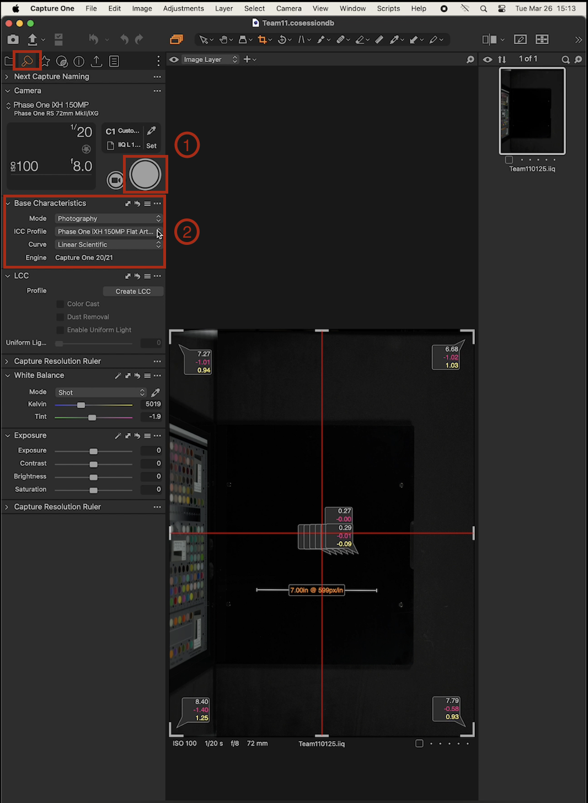{ width="550px" data-title="Base Characteristics" data-description=".custom-desc1"}
    <figcaption>Base Characteristics</figcaption>
    </figure>
    

      
Base Characteristics

    

    1. To begin, click on the **capture button** under the Pre-Flight tool tab, located in the Camera settings.

    2. **`Base Characteristics:`**
        - **`Mode`:** Photography
        - **`ICC Profile`:** Phase One iXH 150 MP Flat Art LED DTPortion
        - **`Curve`:** Linear Scientific

    ## Live View 
    Live View provides a real-time display of what the camera lens is capturing, allowing for adjustments to composition and sharpness. This ensures that the final image meets desired standards before capture.

    <figure markdown>
    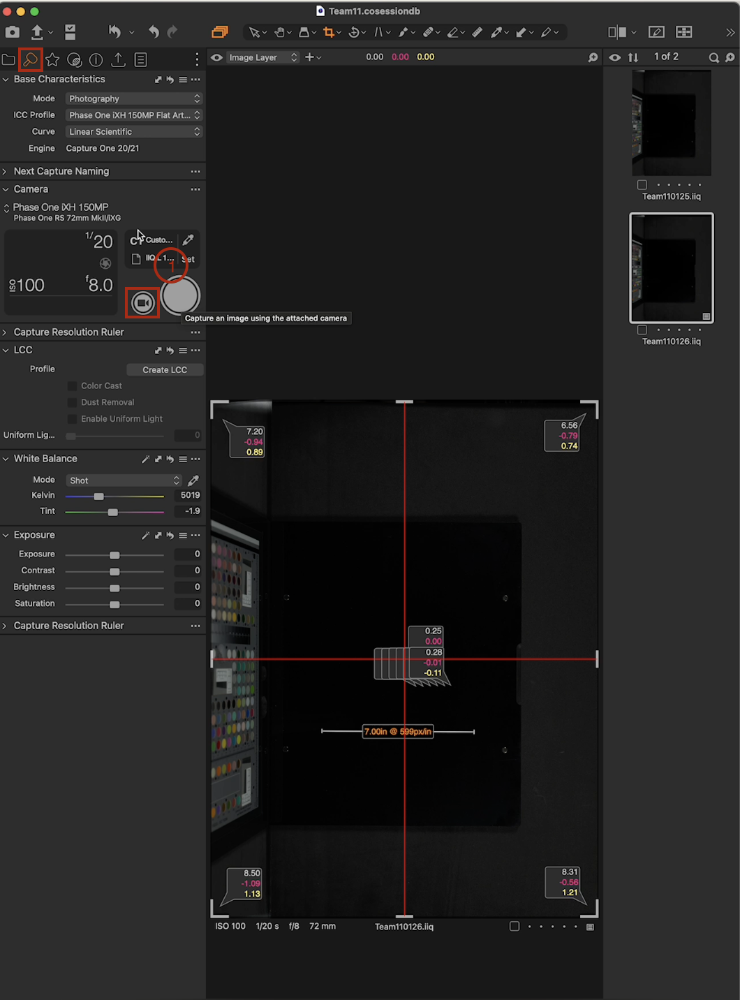{ width="550px" data-title="Live View" data-description=".custom-desc2"}
    <figcaption>Live View</figcaption>
    </figure>
    

      
Live View

    

    1. To enter **Live View** mode click on the **Live View button** under the Pre-Flight tool tab.

        <figure markdown>
        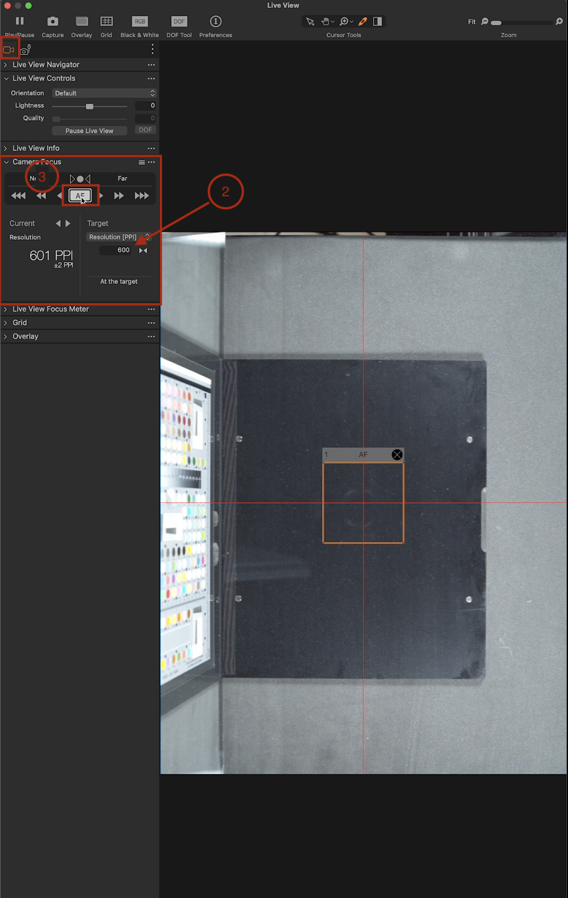{ width="550px" data-title="Auto-Focus" data-description=".custom-desc3"}
        <figcaption>Auto-Focus</figcaption>
        </figure>
        

          
Auto-Focus

          
Lorem ipsum.

        

    2. **Set Camera Resolution:** Under the **Camera Focus** panel, set the camera *Resolution* to *600-PPI*.
    3. **Auto-focus (AF):** In the same panel, select *AF* to allow the software to automatically adjust the camera len focus based on the selected focus point. Drag the prompt to target to lock focus, if necessary.
    4. **Capture:** Use ++windows+"K"++ keys or the hand pedal to capture the target.
    5. **Zoom in:** Using the zoom slider or keyboard shortcuts, zoom in to the 600 mark on the target until the 5 resolution lines are visible.

        <figure markdown>
        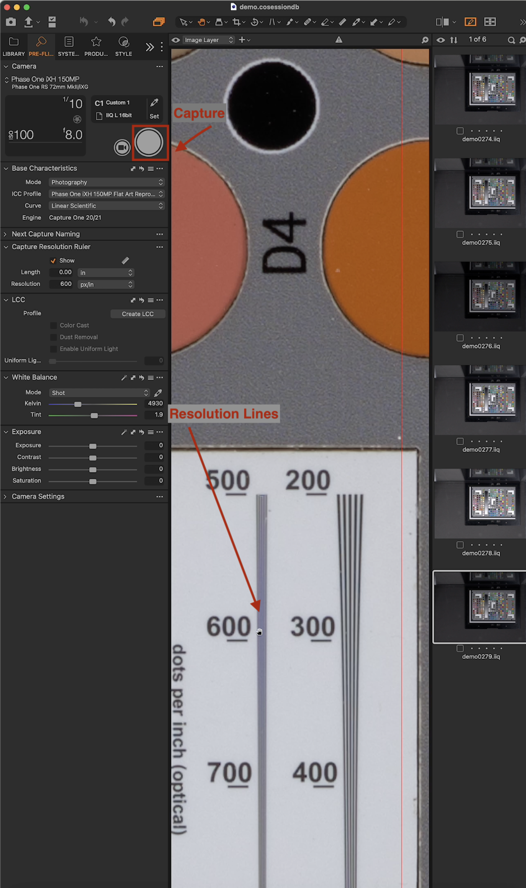{ width="550px" data-title="Resolution Lines" data-description=".custom-desc4"}
        <figcaption>Resolution Lines</figcaption>
        </figure>
        

          
Resolution Lines

        

    6. **Capture:** Press capture to confirm adjustments.

    ## LCC board (white board) 
    The LCC board is used along with the software to correct lens cast, which is produced by uneven lighting across the frame. The LCC board is placed parallel above the glass plate matching the angle of the object being photograph. 

    The LCC board must fill the frame before capturing. 
    
    1. **Prepare LCC board:** Get the LCC board.

        <figure markdown>
        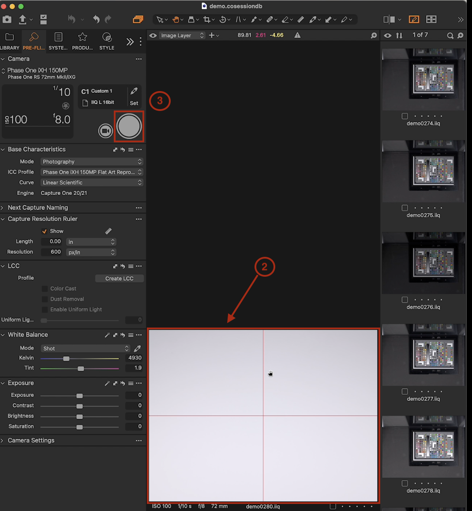{ width="550px" data-title="LĊĊ Board" data-description=".custom-desc5"}
        <figcaption>LCC Board</figcaption>
        </figure>
        

          
LCC Board

          
Lorem ipsum.

        

    2. **Position Board:** Place the board parallel to the glass, and ensure the LCC board covers the Live View frame.
    3. **Capture:** Press Capture in the toolbar or use the keyboard shortcut.

        <figure markdown>
        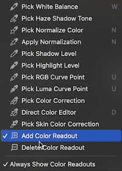{ width="250px" data-title="Add Color Readout" data-description=".custom-desc6"}
        <figcaption>Add Color Readout</figcaption>
        </figure>
        

          
Add Color Readout

        

    4. **Add Color Readout:** Go to the cursor toolbar and select **Add Color Readout**. Add the *Color Readouts* to the four corners and middle of the LCC board, ensure the *Color Readout* in the middle of the target reads **60** or **70**.

        <figure markdown>
        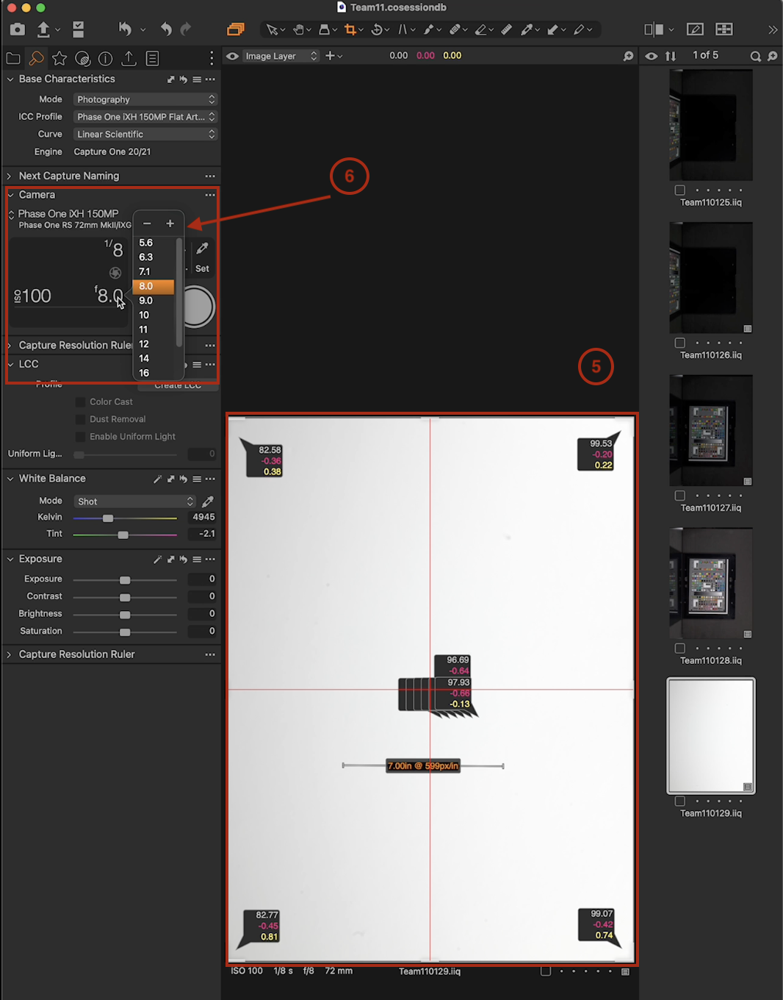{ width="550px" data-title="Color Readout" data-description=".custom-desc7"}
        <figcaption>Color Readout</figcaption>
        </figure>
        

          
Color Readout

        

    5. **Check Readouts:** Make sure *Readouts* in all four corners match the middle.
    6. **Adjust Shutter Speed:** If readouts exceed 70 make the necessary adjustments to the shutter speed.

        <figure markdown>
            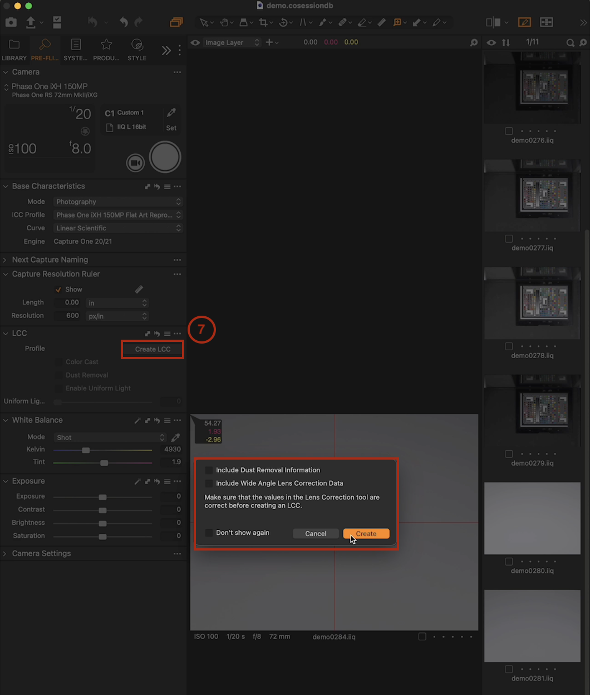{ width="550px" data-title="CreateLCC" data-description=".custom-desc1"}
            <figcaption>Create LCC</figcaption>
            </figure>
            

              
Create LCC

            

    7. **Create LCC:** In the LCC panel, select *Create LCC* and capture the target.  

    ## White Balance
    This process adjusts the colour of the photos captured to accurately represent how they appear in real life under the LCC lighting conditions. Ensuring whites appear truly white rather than a tinted colour.

    <figure markdown>
    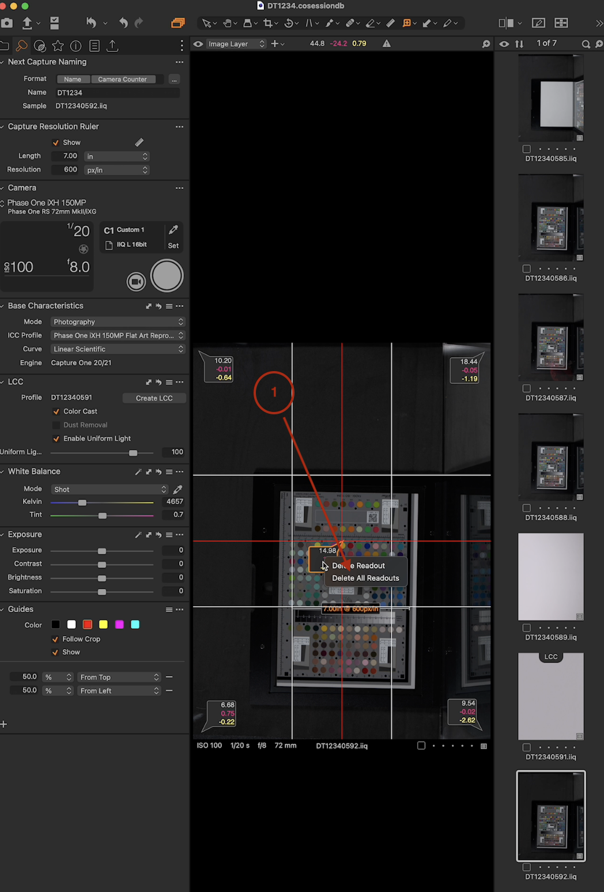{ width="490px" data-title="Delete Readouts" data-description=".custom-desc9"}
    <figcaption>Delete Readouts</figcaption>
    </figure>
    

      
Delete Readouts

      
Lorem ipsum.

    

      
    1. **Delete Readouts:** click with the ++right-button++ on one of the readouts and select delete all to remove.

        <figure markdown>
        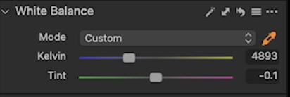{ width="450px" data-title="White Balance" data-description=".custom-desc10"}
        <figcaption>White Balance</figcaption>
        </figure>
        

          
White Balance

          
Lorem ipsum.

        

    2. **Add white balance:** Under *White Balance* in the left pane select the picker (eyedropper) to apply the **White Balance**.
    3. **Zoom In:** Using the zoom controls zoom in on the target to colour patch **70** (value changes based on target) and click on it.
    4. **Coordinate Exposure Settings:** One system does the white balance first, providing the second operator with their setting values. Ensure communication between operators for consistent setting values. 

    ## Exposure 
    Exposure adjustments are based on the amount of light that reaches the camera sensor, and is determined by the shutter speed, aperture and ISO.

    1. **Check Readouts:** Ensure readouts are within the expected range (e.g., close to the colour patch value, ideally 70 but 69.0 is acceptable)
    2. **Add Readouts:** In the cursor tools section, select the *color editor tool*, and from the dropdown list, select *Add Color Readout* to add readouts to first 6 patches (Patch 70 - 95)

        <figure markdown>
        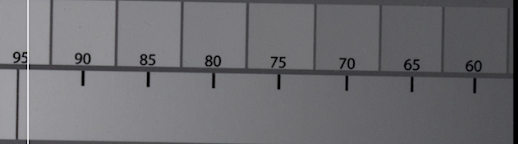{ width="650px" data-title="Before Readouts" data-description=".custom-desc11"}
        <figcaption>Before Readouts</figcaption>
        </figure>
        

          
Before Readouts

          
Lorem ipsum.

        

    

        <figure markdown>
        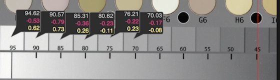{ width="650px" data-title="Color Readouts" data-description=".custom-desc12"}
        <figcaption>Color Readouts</figcaption>
        </figure>
        

          
Color Readouts

          
Lorem ipsum.

        

        !!! note
            Ensure that Readouts are placed in the middle of the color patch for an accurate Readout.

        <figure markdown>
        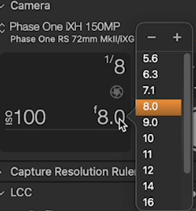{ width="250px" data-title="Shutter Adjustment" data-description=".custom-desc13"}
        <figcaption>Shutter Adjustment</figcaption>
        </figure>
        

          
Shutter Adjustment

          
Lorem ipsum.

        

    3. **Adjust Shutter Speed:** Navigate to the camera settings in the Pre-Flight tab to change the shutter speed to match the correct values, typically adjusting to 1/20 or 1/5 (trigger speed).
    4. **Capture:** Capture to save the setting adjustments as you go.  

=== "dt Versa Flatbed Scanner"

    The Pre-Flight workflow ensures precise configuration of camera settings, which includes camera resolution, focus, LCC, white balance, and exposure, so that images are an accurate reproduction of the original object.

    ## Base Characteristics
    The base characteristics are how the system is supposed to be configured at the start of the preflight.

    <figure markdown>
    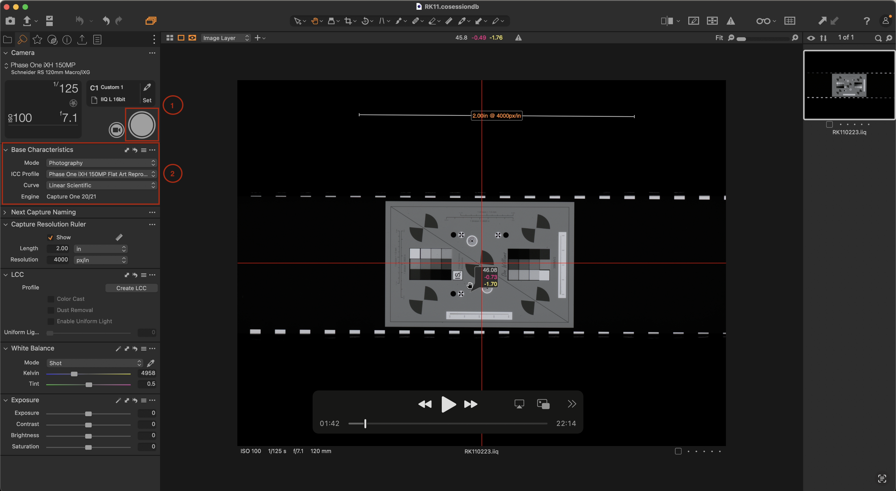{ width="550px" data-title="Base Characteristics" data-description=".custom-desc1"}
    <figcaption>Base Characteristics</figcaption>
    </figure>
    

      
Base Characteristics

    

    1. To begin, click on the **capture button** under the Pre-Flight tool tab, located in the Camera settings.

    2. **`Base Characteristics:`**
        - **`Mode`:** Photography
        - **`ICC Profile`:** Phase One iXH 150 MP Flat Art LED DTPortion
        - **`Curve`:** Linear Scientific

    3. **Transmissive Target Setup:** Place transmissive target in tray with the non-shiny side of the target facing up towards the camera. 

    ## Live View 
    Live View provides a real-time display of what the camera lens is capturing, allowing for adjustments to composition and sharpness. This ensures that the final image meets desired standards before capture.

      <figure markdown>
      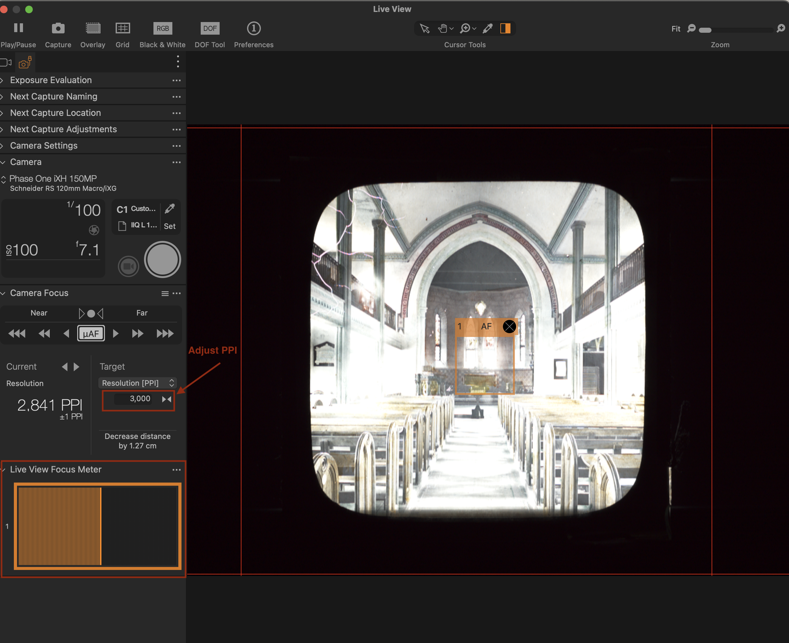{ width="550px" data-title="Adjust Focus" data-description=".custom-desc1"}
      <figcaption>Ajust Focus</figcaption>
      </figure>
      

        
Adjust focus

      

    1. **Set Resolution PPI** Open *Live View* to set the *Resolution PPI* to 4000 or 5000.
        - **Enter PPI Value:** Enter the PPI value to 4000 PPI or 5000 PPI, or click ">" and "<" to adjust the PPI.
        - **Focus:** Use the hand control to manually focus the camera by pushing the up and down keys until the *Live View Focus Meter* is highlighted orange.
        - **Capture:** Capture the target and zoom in on the purple icons to ensure the resolution is clear.

            !!! note "NOTE"
                When zooming in on the purple icons check for crisp, well-defined edges, and fine details with no blurring or softness. 
        <figure markdown>
          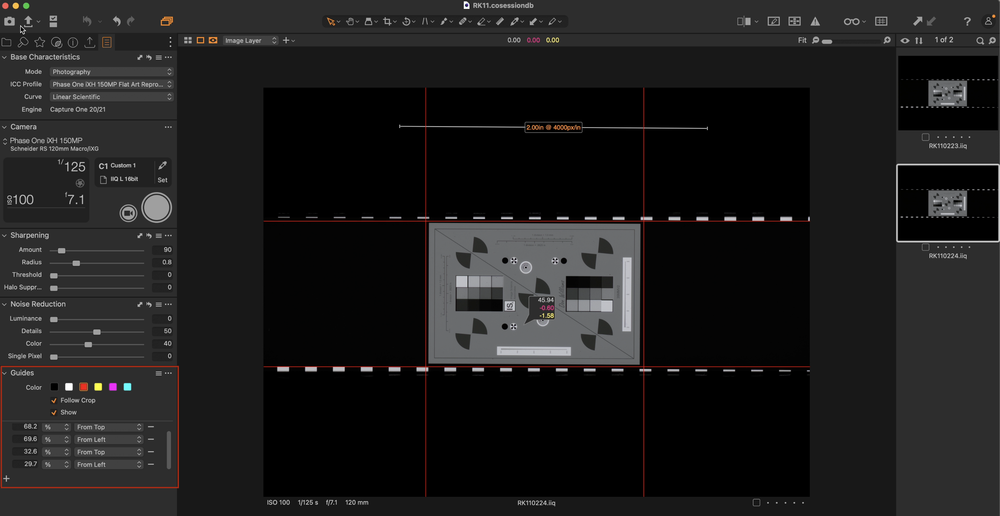{ width="550px" data-title="Guidelines" data-description=".custom-desc1"}
          <figcaption>Guidelines</figcaption>
          </figure>
          

            
Apply guidelines

          

    2. **Apply Guidelines:** Navigate to *Guides*, under the *System Check tab* to apply guidelines and position the guidelines, so the film target is in the center of the guidelines.
        - **Capture Target:** Capture to save setting.  

    3. **Remove Transmissive Target:** Once guidelines are applied, remove the transmissive target from the target tray.

    4. **Check Lighting:** Put the camera in live view mode and ensure that the lighting covers all borders of the capture area.

        !!! note "Note"
            If the light doesn't cover all four corners of the capture area use the sliders on the the flatbed bench to adjust the light. 

        <figure markdown>
        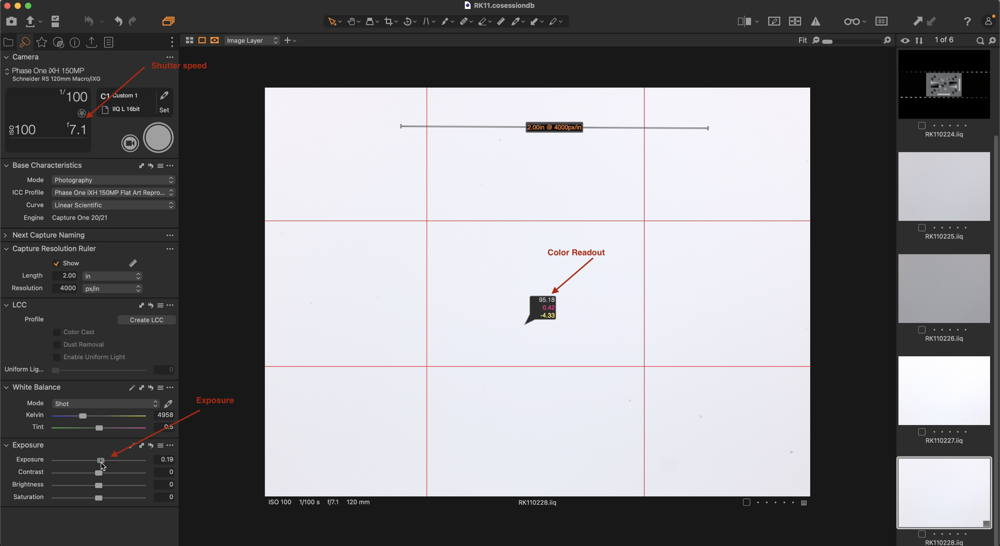{ width="550px" data-title="ColorReadout" data-description=".custom-desc1"}
        <figcaption>Color Readout</figcaption>
        </figure>
        

          
Color Readout.

        

    5. **Adjust Color Readout:** Go to the cursor toolbar and select **Add Color Readout**. Apply the color readout to the middle of the capture area in *Live View*. Adjust the shutter speed to get as close to 95 and adjust the exposure slidder to ensure *Readout* is 95.
    
        !!! note
            If Readouts are 100, it is too high. Change shutter speed and aperture until Readouts read 95 or close to 95.

    
    <figure markdown>
            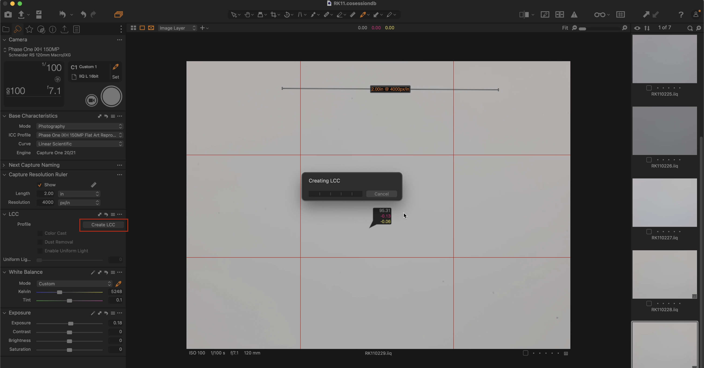{ width="550px" data-title="CreateLCC" data-description=".custom-desc1"}
            <figcaption>Create LCC</figcaption>
            </figure>
            

              
Create LCC

            

    6. **Create LCC:** In the LCC panel, select *Create LCC* and capture the target. 

    ## White Balance
    This process adjusts the colour of the photos captured to accurately represent how they appear in real life under the LCC lighting conditions. Ensuring whites appear truly white rather than a tinted colour.

    1. **Delete Readouts:** click with the ++right-button++ on one of the readouts and select delete all to remove.

    2. **Add White Balance:** Under *White Balance* in the left pane select the picker to apply, then click on a neutral area of the photo to set the white balance. Capture the image. 

    **Exposure:**
    Exposure adjustments are based on the amount of light that reaches the camera sensor, and is determined by the shutter speed, aperture and ISO.

    **Adjust Exposure:** In the *PreFlight tab, under *Exposure panel*, select the *Exposure slidder* to adjust the exposure, when necessary.  
