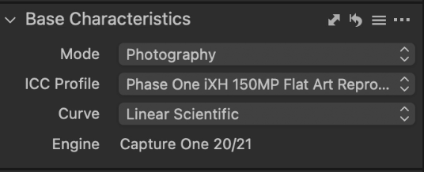

## Pre-Flight Workflow DT Versa Flatbed 

The Pre-Flight workflow ensures that the camera settings are configured properly, which includes camera resolution, focus, LCC, white balance, and exposure, so that images are an accurate reproduction of the original object.

## Base characteristics
The base characteristics are how the system is supposed to be configured at the start of the preflight.

<figure markdown>
{ width="550px" data-title="Base Characteristics" data-description=".custom-desc1"}
<figcaption>Base Characteristics</figcaption>
</figure>

  
Base Characteristics

1. To being, click on the **capture button** under the Pre-Flight tool tab, located in the Camera settings.

2. **`Base Characteristics:`**
    - **`Mode`:** Photography
    - **`ICC Profile`:** Phase One iXH 150 MP Flat Art LED DTPortion
    - **`Curve`:** Linear Scientific

3. **Transmissive Target Setup:** Place transmissive target in tray with the non-shiny side of the target facing up towards the camera. 

## Live View 
Live View provides a real-time display of what the camera lens is capturing, allowing for adjustments to composition and sharpness. This ensures that the final image meets desired standards before capture.

1. **Set Resolution PPI** Open *Live View* to set the *Resolution PPI*. Set the PPI to 4000 or 5000. 
- **Enter PPI Value:**Enter the PPI value to 4000 PPI or 5000 PPI, or click ">" and "<" to adjust the PPI.
- **Focus:**Use the hand control to manually focus the camera by pushing the up and down keys until the *Live View Focus Meter* is highlighted orange.
- **Capture:** Open *Live View*. Capture the target and zoom in on the purple icons to ensure the resolution is clear.

!!! note ""
    When zooming in on the purple icons look for crisp, well-defined edges, and fine details with no blurring or softness. 

2. **Apply Guidelines:** Apply guidelines and position film target to the center of the guidelines.
- **Capture target:** Capture to save the setting adjustments as you go.  

3. **Remove Transmissive Target:** Once guidelines are applied, remove the transmissive target from the target tray.

4. **Check Lighting:** Put the camera in live view mode and ensure that the lighting covers all borders of the capture area.

5. **Adjust Color Readouts:** Apply color readouts. Ensure Readouts are 95; if the Readouts are 100, it is too high. Change shutter speed and aperture until Readouts read 95 or close to 95.

6. **Create LCC:** In the LCC panel, select *Create LCC* and capture the target. 

## White balance
This process adjusts the colour of the photos captured to accurately represent how they appear in real life under the LCC lighting conditions. Ensuring whites appear truly white rather than a tinted colour.

1. **Delete Readouts:** click with the ++right-button++ on one of the readouts and select delete all to remove.

2. **Add White Balance:** Under *White Balance* in the left pane select the picker to apply, then click on a neutral area of the photo to set the white balance. Capture the image. 

**Exposure:**
Exposure adjustments are based on the amount of light that reaches the camera sensor, and is determined by the shutter speed, aperture and ISO.

**Adjust Exposure:** In the left panel, under Exposure, select the *Exposure slidder* to adjust.  